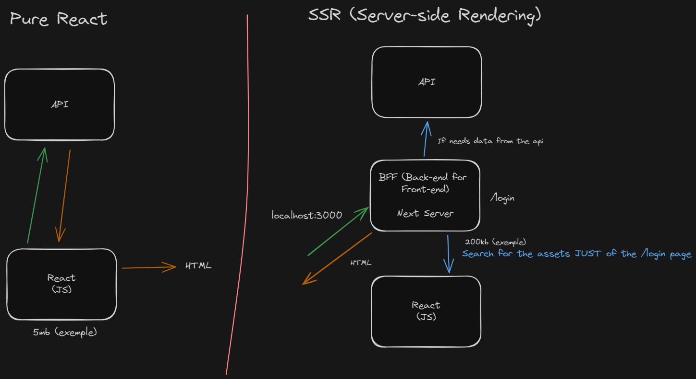

  <h1>Next 13 Fundamentals</h1>
  
  

    <h3>"Pure" React VS SSR</h3>
    

      
    

  

  

    <h3>Server VS Client Component</h3>
    
Server compontent = Static components refer to elements that do not involve user interaction.

    
Client compontent = JS needs to be sent to the browser/client.

    

      Hydration = Refers to the process of reactivating the functionality of a React application that has been pre-rendered on the server. Hydration is a critical step to ensure that client-side interactivity and functionality are ready as soon as the page loads. Put simply, hydration is the process of connecting the React components rendered on the server to interactive components in the browser. This enables a smooth transition between the initial server-side rendering and client-side interaction. The ability to efficiently hydrate the application is crucial to ensuring a responsive and dynamic user experience.
    

  

